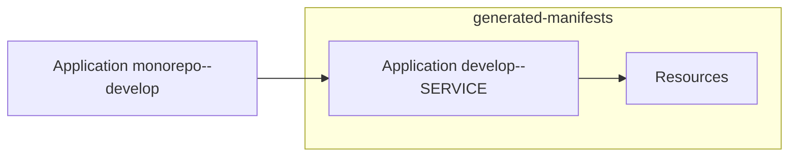
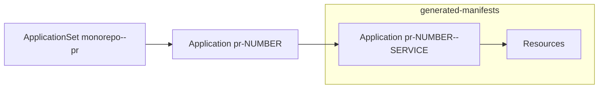

# monorepo-deploy-actions

This is a set of GitHub Actions to deploy microservices in a mono-repository (monorepo).

## Design

### Structure of monorepo

Our monorepo contains a set of microservices with application code and Kubernetes manifests.
Here is the example of directory structure.

```
monorepo
├── backend
|   ├── sources...
|   └── kubernetes
|       ├── base
|       └── overlays
|           ├── develop
|           |   └── kustomization.yaml
|           └── staging
|               └── kustomization.yaml
├── frontend
|   ├── sources...
|   └── kubernetes
|       └── overlays
|           └── ...
└── ...
```

We adopt this strcuture for the following advantages:

- An owner of microservice (i.e. product team) has strong ownership for both application and manifest
- We can change both application and manifest in a pull request

We deploy a set of services from a branch to a namespace.
For example,

- When `develop` branch is pushed,
  - Build a Docker image from `develop` branch
  - Run kustomize build against `develop` overlay
  - Deploy to `develop` namespace
- When a pull request is created,
  - Build a Docker image from head branch
  - Run kustomize build against `staging` overlay
  - Deploy to an ephemeral namespace like `pr-12345`

Consequently, a structure of monorepo is like below.

```
monorepo
└── ${service}
    └── kubernetes
        └── overlays
            └── ${overlay}
                └── kustomization.yaml
```

Here are the definitions of words.

| Name                     | Description                                 | Example    |
| ------------------------ | ------------------------------------------- | ---------- |
| `overlay`                | Name of the overlay to build with Kustomize | `staging`  |
| `namespace`              | Namespace to deploy into a cluster          | `pr-12345` |
| `service`                | Name of a microservice                      | `backend`  |

### Structure of Argo CD Applications

We adopt [App of Apps pattern of Argo CD](https://argoproj.github.io/argo-cd/operator-manual/cluster-bootstrapping/) for deployment hierarchy.

For a typical namespace such as develop or production, it is deployed with the below applications.



For a pull request namespace, it is deployed with the below applications and [the pull request generator](https://argo-cd.readthedocs.io/en/stable/operator-manual/applicationset/Generators-Pull-Request/).



A namespace branch contains a set of generated manifest and Application manifest per a service.

```
destination-repository  (branch: ns/${source-repository}/${overlay}/${namespace})
├── applications
|   └── ${namespace}--${service}.yaml  (Application)
└── services
    └── ${service}
        └── generated.yaml
```

## Development

Node.js and pnpm is required.

```sh
brew install node@20
corepack enable pnpm
```

### Release workflow

When a pull request is merged into main branch, a new minor release is created by GitHub Actions.
See https://github.com/int128/release-typescript-action for details.

### Dependency update

You can enable Renovate to update the dependencies.
See https://github.com/int128/typescript-action-renovate-config for details.
