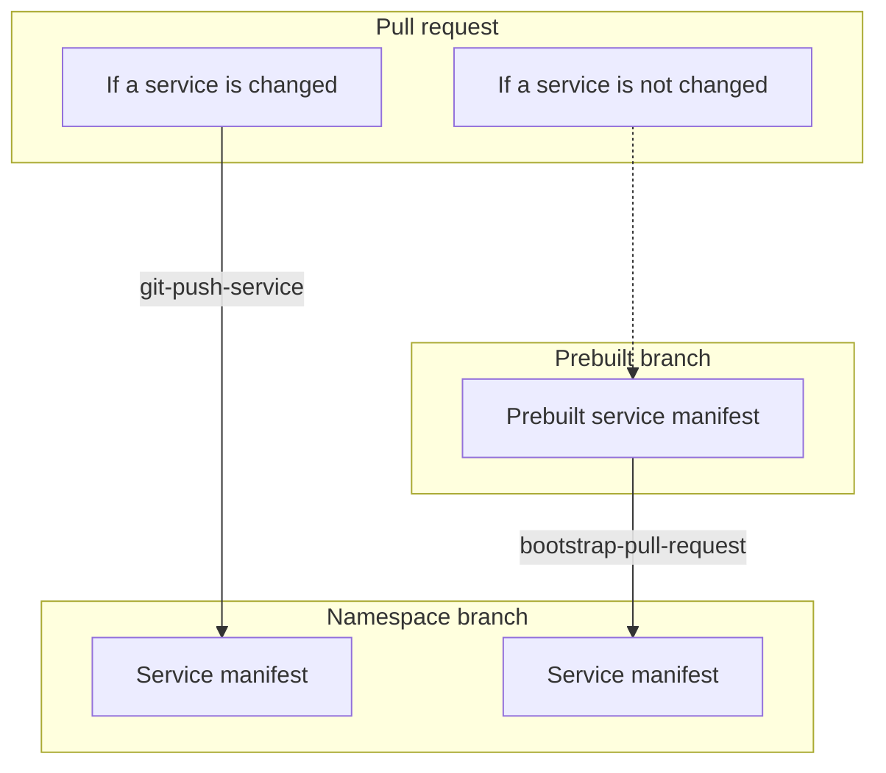
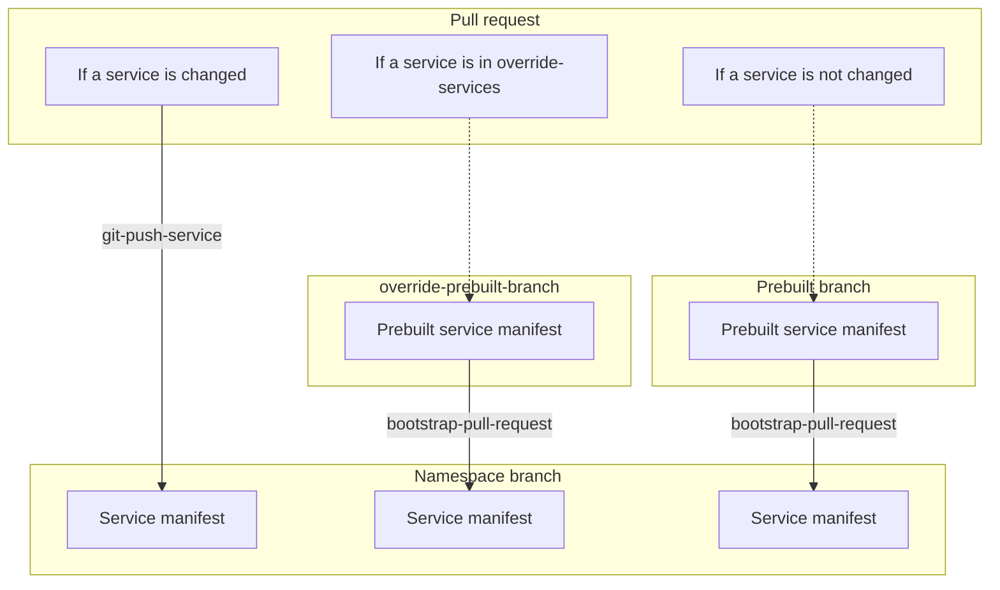

# bootstrap-pull-request [](https://github.com/quipper/monorepo-deploy-actions/actions/workflows/bootstrap-pull-request.yaml)

This is an action to bootstrap the pull request namespace.
When a pull request is created or updated, this action copies the service manifests from the prebuilt branch.

## Getting Started

To bootstrap the pull request namespace,

```yaml
name: pr-namespace / bootstrap

on:
  pull_request:

jobs:
  bootstrap-pull-request:
    runs-on: ubuntu-latest
    timeout-minutes: 10
    steps:
      - uses: actions/checkout@v4
      - uses: int128/list-matched-workflows-action@v0
        id: list-matched-workflows
        with:
          workflows: |
            .github/workflows/*--deploy.yaml
      - uses: actions/github-script@v7
        id: changed-services
        env:
          matched_workflows_json: ${{ steps.list-matched-workflows.outputs.matched-workflows-json }}
        with:
          result-encoding: string
          script: |
            // It assumes that the workflow files are named like service--deploy.yaml
            return JSON.parse(process.env.matched_workflows_json)
              .map((workflow) => workflow.filename.replace(/--.+$/, ''))
              .join('\n')
      - uses: quipper/monorepo-deploy-actions/bootstrap-pull-request@v1
        with:
          overlay: pr
          namespace: pr-${{ github.event.number }}
          destination-repository: octocat/generated-manifests
          # If a service is changed in the pull request, it should be deployed by another workflow.
          changed-services: ${{ steps.changed-services.outputs.result }}
          # If a service is not changed in the pull request, copy it from the prebuilt branch.
          prebuilt-branch: prebuilt/source-repository/main/workload
          destination-repository-token: ${{ steps.destination-repository-github-app.outputs.token }}
          substitute-variables: |
            NAMESPACE=pr-${{ github.event.number }}
```

This action creates a namespace branch into the destination repository.

```
ns/${source-repository}/${overlay}/${namespace-prefix}${pull-request-number}
```

It creates the following directory structure.

```
.
├── applications
|   └── ${namespace}--${service}.yaml
└── services
    └── ${service}
        └── generated.yaml
```

This action writes a service into the namespace branch by the following rules:

- If a service is changed in the pull request, it should be deployed by git-push-service action of another workflow.
  This action will not overwrite the service.
- If a service is not changed in the pull request, this action will copy the service from the prebuilt branch.

Here is the diagram.



## Override the prebuilt branch

You can override the prebuilt branch for the specific services.
For example,

```yaml
jobs:
  bootstrap-pull-request:
    steps:
      - uses: actions/checkout@v4
      # ...omit...
      - uses: quipper/monorepo-deploy-actions/bootstrap-pull-request@v1
        with:
          overlay: pr
          namespace: pr-${{ github.event.number }}
          destination-repository: octocat/generated-manifests
          # If a service is changed in the pull request, it should be deployed by another workflow.
          changed-services: ${{ steps.changed-services.outputs.result }}
          # If a service is not changed in the pull request, copy it from this prebuilt branch.
          prebuilt-branch: prebuilt/source-repository/main/proxy
          # For the specific services, copy them from this prebuilt branch.
          override-prebuilt-branch: prebuilt/source-repository/main/workload
          override-services: ${{ steps.dependent-services.outputs.result }}
          destination-repository-token: ${{ steps.destination-repository-github-app.outputs.token }}
          substitute-variables: |
            NAMESPACE=pr-${{ github.event.number }}
```

This action writes a service into the namespace branch by the following rules:

- If a service is changed in the pull request, it should be deployed by git-push-service action of another workflow.
  This action will not overwrite the service.
- If a service is in `override-services`, this action will copy the service from `override-prebuilt-branch`.
- If a service is not changed in the pull request, this action will copy the service from `prebuilt-branch`.

Here is the diagram.



## Specification

See [action.yaml](action.yaml).
