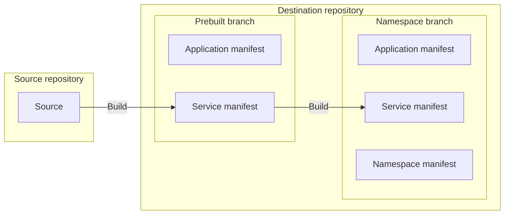

# bootstrap-pull-request [](https://github.com/quipper/monorepo-deploy-actions/actions/workflows/bootstrap-pull-request.yaml)

This is an action to bootstrap the pull request namespace.
When a pull request is created or updated, this action copies the service manifests from the prebuilt branch.



## Getting Started

To bootstrap the pull request namespace,

```yaml
name: pr-namespace / bootstrap

on:
  pull_request:

jobs:
  bootstrap-pull-request:
    runs-on: ubuntu-latest
    timeout-minutes: 10
    steps:
      - uses: actions/checkout@v4
      # This action needs to be run after all services are pushed.
      - uses: int128/wait-for-workflows-action@v1
        with:
          filter-workflow-names: |
            * / deploy
      - uses: quipper/monorepo-deploy-actions/bootstrap-pull-request@v1
        with:
          overlay: pr
          namespace: pr-${{ github.event.number }}
          destination-repository: octocat/generated-manifests
          prebuilt-branch: prebuilt/source-repository/pr
          destination-repository-token: ${{ steps.destination-repository-github-app.outputs.token }}
          namespace-manifest: deploy-config/overlays/pr/namespace.yaml
          substitute-variables: |
            NAMESPACE=pr-${{ github.event.number }}
```

This action creates a namespace branch into the destination repository.

```
ns/${source-repository}/${overlay}/${namespace-prefix}${pull-request-number}
```

It creates the following directory structure.

```
.
├── applications
|   ├── namespace.yaml
|   └── ${namespace}--${service}.yaml
└── services
    └── ${service}
        └── generated.yaml
```

It bootstraps the namespace branch by the following steps:

1. Delete the outdated application manifests
2. Copy the services from prebuilt branch
3. Write the namespace manifest

### 1. Delete the outdated application manifests

This action deletes the outdated application manifests in the namespace branch.
If an application manifest is pushed by `git-push-service` action on the current commit, this action preserves the application manifest.
Otherwise, this action deletes the application manifest.

For example, if the namespace branch has the below application manifests,
this action deletes `applications/pr-123--backend.yaml`.

```yaml
# applications/pr-123--backend.yaml
apiVersion: argoproj.io/v1alpha1
kind: Application
metadata:
  annotations:
    github.action: bootstrap-pull-request
```

```yaml
# applications/pr-123--frontend.yaml
apiVersion: argoproj.io/v1alpha1
kind: Application
metadata:
  annotations:
    github.action: git-push-service
    github.head-sha: 0123456789abcdef0123456789abcdef01234567 # The current commit
```

Note that this action needs to be run after all of `git-push-service` actions.

### 2. Copy the services from prebuilt branch

This action copies the services from prebuilt branch to the namespace branch.

For example, if the prebuilt branch has 2 services `backend` and `frontend`,
the namespace branch will be the below structure.

```
.
├── applications
|   ├── pr-123--backend.yaml
|   └── pr-123--frontend.yaml
└── services
    ├── backend
    |   └── generated.yaml
    └── frontend
        └── generated.yaml
```

If the namespace branch contains any application manifests, this action will not overwrite them.

All placeholders will be replaced during copying the service manifests.
For example, if `NAMESPACE=pr-123` is given by `substitute-variables` input,
this action will replace `${NAMESPACE}` with `pr-123`.

### 3. Write the namespace manifest

This action copies the namespace manifest to path `/applications/namespace.yaml` in the namespace branch.

```
.
└── applications
    └── namespace.yaml
```

All placeholders will be replaced during copying the namespace manifest.
For example, if `NAMESPACE=pr-123` is given by `substitute-variables` input,
this action will replace `${NAMESPACE}` with `pr-123`.

## Consistency considerations

### Namespace branch lost

1. When a pull request is created, git-push-service action writes the service manifests to the namespace branch.
1. The namespace branch is deleted accidentally.
1. When the label is added to the pull request, this action creates the namespace branch with all services from the prebuilt branch.
   It confuses the user because the namespace branch does not contain the change of the pull request.

```yaml
error-if-namespace-branch-not-exists: ${{ github.event.action == 'labeled' }}
```

## Specification

See [action.yaml](action.yaml).
