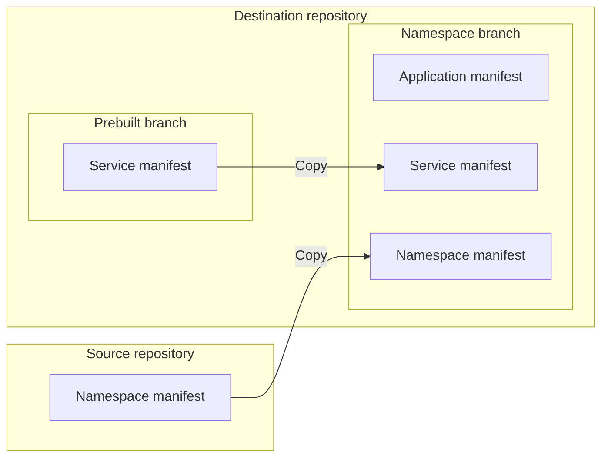

# bootstrap-pull-request [](https://github.com/quipper/monorepo-deploy-actions/actions/workflows/bootstrap-pull-request.yaml)

This is an action to bootstrap the pull request namespace.
When a pull request is created or updated, this action copies the service manifests from the prebuilt branch.



## Getting Started

To bootstrap the pull request namespace,

```yaml
name: pr-namespace / bootstrap

on:
  pull_request:

jobs:
  bootstrap-pull-request:
    runs-on: ubuntu-latest
    timeout-minutes: 10
    steps:
      - uses: actions/checkout@v3
      - uses: quipper/monorepo-deploy-actions/bootstrap-pull-request@v1
        with:
          overlay: pr
          namespace: pr-${{ github.event.number }}
          destination-repository: octocat/generated-manifests
          destination-repository-token: ${{ steps.destination-repository-github-app.outputs.token }}
          namespace-manifest: deploy-config/overlays/pr/namespace.yaml
          substitute-variables: |
            NAMESPACE=pr-${{ github.event.number }}
```

This action creates a namespace branch into the destination repository.

```
ns/${source-repository}/${overlay}/${namespace-prefix}${pull-request-number}
```

It creates the following directory structure.

```
.
├── applications
|   ├── namespace.yaml
|   └── ${namespace}--${service}.yaml
└── services
    └── ${service}
        └── generated.yaml
```

It assumes that the below name of prebuilt branch exists in the destination repository.

```
prebuilt/${source-repository}/${overlay}
```

It bootstraps the namespace branch by the following steps:

- Copy the services from prebuilt branch.
- Write the namespace manifest

### Copy the services from prebuilt branch

This action copies the services from prebuilt branch to the namespace branch.

For example, if the prebuilt branch has 2 services `backend` and `frontend`,
the namespace branch will be the below structure.

```
.
├── applications
|   ├── pr-123--backend.yaml
|   └── pr-123--frontend.yaml
└── services
    ├── backend
    |   └── generated.yaml
    └── frontend
        └── generated.yaml
```

All placeholders will be replaced during copying the service manifests.
For example, if `NAMESPACE=pr-123` is given by `substitute-variables` input,
this action will replace `${NAMESPACE}` with `pr-123`. 

If a service was pushed by `git-push-service` action,
this action does not overwrite it.

**Case 1**: If a service is not changed in a pull request,

1. When a pull request is created, this action copies the service from prebuilt branch.
1. When the pull request is updated, this action copies the service from prebuilt branch.
   This is needed to follow the latest change of prebuilt branch.

**Case 2**: If a service is changed in a pull request,

1. When a pull request is created,
   - This action copies the service from prebuilt branch.
   - `git-push-service` action overwrites the service.
1. When the pull request is synchronized,
   - This action does not overwrite the service.

### Write the namespace manifest

This action copies the namespace manifest to path `/applications/namespace.yaml` in the namespace branch.

```
.
└── applications
    └── namespace.yaml
```

All placeholders will be replaced during copying the namespace manifest.
For example, if `NAMESPACE=pr-123` is given by `substitute-variables` input,
this action will replace `${NAMESPACE}` with `pr-123`. 

## Specification

See [action.yaml](action.yaml).
